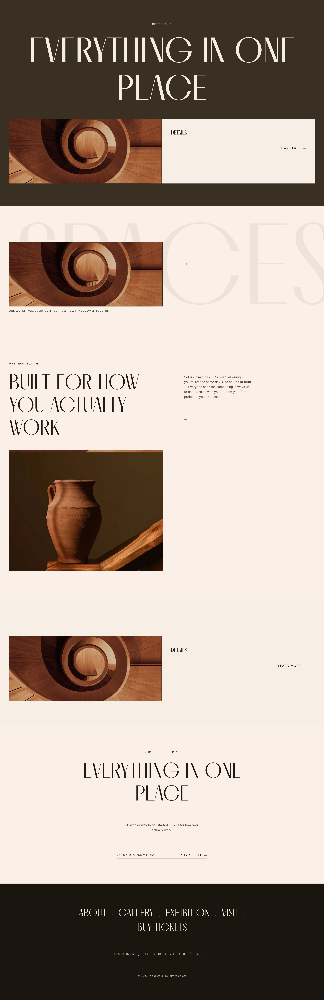
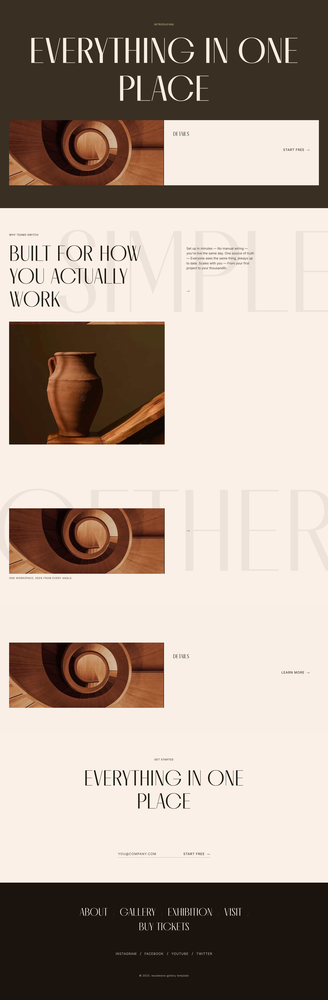
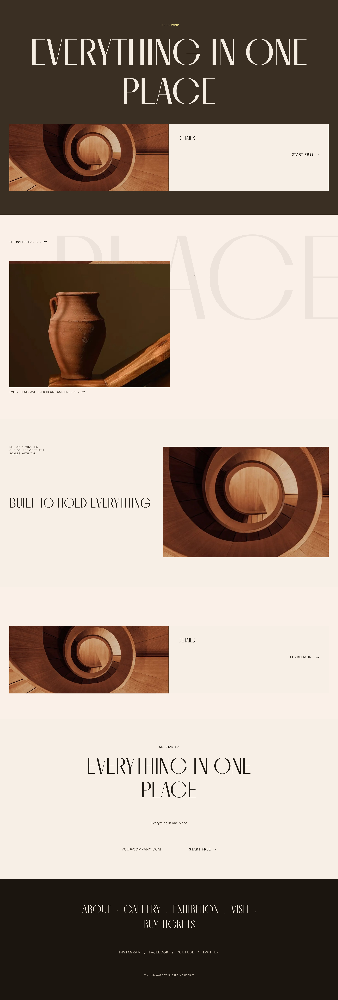
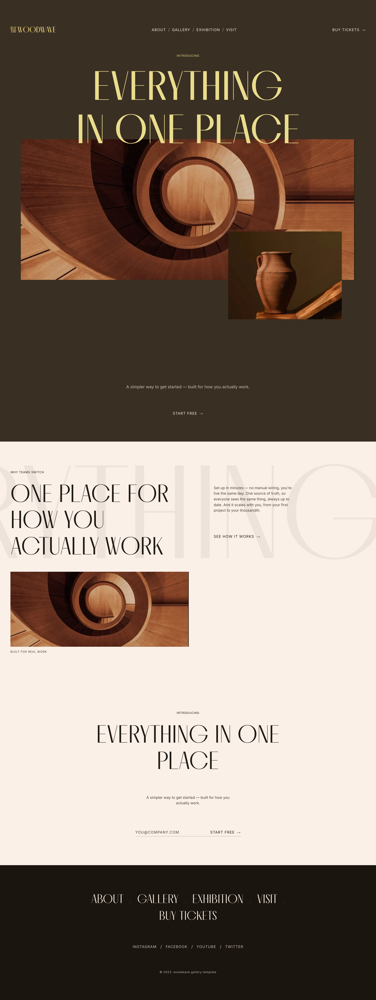
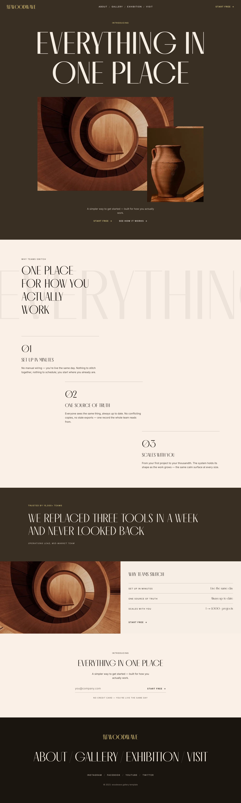

# WoodWave — Hybrid Generation Report (Phases 2–4)

**Question (from the A/B `REPORT`):** can the *hybrid* loop — the AI emits a structured
`composition.v1` object, a deterministic renderer draws it, and `onbrand_check --composition`
gates it — deliver **Arm A's brand-safety WITH Arm B's variety**?

**Answer: yes.** N=5 live runs from the same brief, same brand, same style:
**5/5 OVERALL PASS · 5/5 brief-fidelity 3/3 · 5 distinct archetypes · 2 gate-green novel sections.**

- **Model:** `claude-opus-4-8` (adaptive thinking), one structured call per attempt, ≤2 repair retries.
- **Fairness:** identical inputs to the A/B arms (md5 asserted in `run_hybrid.py`):
  `brand.yaml 7eab6632…` · `signup-launch.md 68ea09f2…` · `editorial-luxury.md 4bb79e0a…`.
- **Gate:** `onbrand_check.py --composition` (hard neverDo + hard composition invariants), JSON scorecard per page.

---

## 1. Results matrix — 5 hybrid runs + 2 baselines

| variant | gate (`--composition`) | brief fidelity (value_props) | structure (archetype sequence) | distinct archetypes | novel§ | repair tries |
|---|---|---|---|---|---|---|
| **Arm A** (structured) | PASS | **1/3** (props melted into 1 body) | fixed brand `layouts[]` order | n/a (fixed) | — | — |
| **Arm B** (HTML-first) | **FAIL** (brand coupling) | 3/3 | free HTML | n/a | — | — |
| **run-1** library-faithful | **PASS** | **3/3** | split · collage · collage · split · stack | 3 | ✅ `cta` | 0 |
| **run-2** adapt-seeds | **PASS** | **3/3** | split · collage · **cards** · split · stack | 4 | — | 0 |
| **run-3** propose-novel | **PASS** | **3/3** | split · collage · collage · split · stack | 3 | ✅ `value-props-run` | 0 |
| **run-4** reorder-surfaces | **PASS** | **3/3** | split · collage · **interlock** · split · stack | 4 | — | 1 |
| **run-5** max-contrast | **PASS** | **3/3** | split · collage · **cards** · **interlock** · stack | **5** | — | 2 |

§ *novel* = a `novelty:novel` section that gated GREEN → eligible for `layout_library.promote`.

**Across the set:** 5 of the 6 drawable archetypes exercised — **`split, collage, cards, interlock, stack`** —
versus Arm A's single fixed order. Every run rendered all **three** value_props (Arm A's ceiling was 1/3).

### Screenshots

| run-1 | run-2 | run-3 |
|---|---|---|
|  |  |  |

| run-4 | run-5 | Arm A (baseline) | Arm B (baseline) |
|---|---|---|---|
|  |  |  |  |

---

## 2. Rubric scores (see `RUBRIC.md`)

| dimension | weight | measure | score |
|---|---|---|---|
| Gate conformance | 0.30 | **5/5** OVERALL PASS (no Arm-B coupling regressions) | 1.00 |
| Brief fidelity | 0.25 | **5/5** runs at 3/3 value_props (Arm A: 1/3) | 1.00 |
| Structural variety | 0.20 | **5** distinct archetypes across set (≥3 target); run-5 = 5 on one page | 1.00 |
| Novelty | 0.15 | **2** gate-green novel sections (≥1 target), promotion-eligible | 1.00 |
| Cost / latency | 0.10 | mean 1.6 attempts · 80.1 s · 7.7k out-tok | 0.70 |
| **Composite** | | | **0.97** |

### Cost / latency (from `generation-telemetry.json`)

| run | attempts | wall s | in tok | out tok |
|---|---|---|---|---|
| run-1 | 1 | 69.2 | 12,265 | 6,267 |
| run-2 | 1 | 52.7 | 12,278 | 4,908 |
| run-3 | 1 | 62.5 | 12,277 | 5,847 |
| run-4 | 2 | 93.1 | 24,702 | 9,141 |
| run-5 | 3 | 122.8 | 37,133 | 12,443 |
| **mean** | **1.6** | **80.1** | **19,731** | **7,721** |

**Repair loop, observed working:** run-4 greened on attempt 1 after the gate flagged missing
brand imagery; run-5 recovered across *asset-fidelity → schema → green* over 3 attempts.
Runs 1–3 greened on **attempt 0**.

---

## 3. Promotion-eligible novel structures

Two `novelty:novel` sections gated GREEN and are eligible for `layout_library.promote`
(into `runs/woodwave/brand/layout-library.yaml`):

- **run-1 `cta`** — a novel closing conversion `stack` recomposition (seededFrom: null).
- **run-3 `value-props-run`** — a novel `collage` that carries the three value_props as an
  editorial body-run behind a ghost watermark (seededFrom: null), on-brand and gate-legal.

This is variety Arm A **structurally cannot** produce (it walks a fixed `layouts[]`), and that
Arm B produced only by going **off-brand** (gate FAIL).

---

## 4. Verdict — hybrid vs Arm A / Arm B

| test | result |
|---|---|
| Gate safety ≥ Arm A (no Arm-B coupling fails) | ✅ 5/5 PASS |
| Beats Arm A on brief fidelity (≥1 run 3/3) | ✅ **all 5** at 3/3 (Arm A 1/3) |
| Beats Arm A on structural variety (≥3 distinct archetypes) | ✅ 5 distinct |
| ≥1 gate-green novel section | ✅ 2 (run-1, run-3) |

**The hybrid delivers Arm A's brand-safety AND Arm B's variety — without Arm B's off-brand
drift.** The AI gets real layout freedom (select/order/recompose within drawable archetypes,
propose novel sections) while every page is drawn by the deterministic renderer and cleared by
the hard `--composition` gate.

---

## 5. Studio lanes (port 1500 — HTTP 200 confirmed, no restart needed)

Surfaced as variant lanes (symlinks + `label.txt`) under `runs/woodwave/brand/variants/`,
mirroring the arm lanes:

- http://localhost:1500/runs/woodwave/brand/variants/hybrid-run-1/index.html
- http://localhost:1500/runs/woodwave/brand/variants/hybrid-run-2/index.html
- http://localhost:1500/runs/woodwave/brand/variants/hybrid-run-3/index.html
- http://localhost:1500/runs/woodwave/brand/variants/hybrid-run-4/index.html
- http://localhost:1500/runs/woodwave/brand/variants/hybrid-run-5/index.html

Each lane serves its `index.html` + symlinked `assets/` (hero image verified 200).

---

## 6. Reproduce

```bash
# N=5 live (needs ANTHROPIC_API_KEY in ../../.env.local)
./venv/bin/python experiments/woodwave-hybrid/run_hybrid.py
# harness wiring only, no model call
./venv/bin/python experiments/woodwave-hybrid/run_hybrid.py --dry-run
# render any saved composition deterministically + gate
./venv/bin/python brand_pipeline/render_composition.py \
  experiments/woodwave-hybrid/run-5/composition.json \
  experiments/woodwave-ab/inputs/brand/brand.yaml -o /tmp/r5 --style editorial-luxury
./venv/bin/python brand_pipeline/onbrand_check.py \
  experiments/woodwave-ab/inputs/brand/brand.yaml /tmp/r5 \
  --layout opening-bookend --style editorial-luxury --composition
```

Artifacts per run: `composition.json` · `index.html` · `assets/` ·
`onbrand-report.{md,json}` · `generation-telemetry.json` · `screenshot.png`. Aggregate gate
matrix + rubric inputs: `results.json`.

---

# PART B — style-gated off-grid EXPANSION (results)

Part B makes the generator **expand beyond the captured layout set** — but only when the
base style says it may. A new base-style capability flag **`offGridExpansion`** gates the
freedom envelope; an ablation proves the flag (not the prompt) drives the difference; two
guardrails keep the expansion brand-safe and compounding.

## 1. Flag wiring (files + where TRUE/FALSE)

| file | change |
|---|---|
| `brand_pipeline/styles.py` | `Style.off_grid_expansion: bool`; parsed by `_parse_off_grid_expansion` (front-matter `offGridExpansion`, tolerant of `capabilities:` + snake_case; absent ⇒ False). Exposed on `RenderContext.off_grid_expansion`. |
| `styles/radical-editorial.md` | front-matter **`offGridExpansion: true`** |
| `styles/editorial-luxury.md` | front-matter **`offGridExpansion: true`** |
| `styles/corporate-saas-clean.md` | front-matter **`offGridExpansion: false`** |
| `styles/composition-rules.md` | `freedom_envelope.off_grid_treatments_gated` + `§5a` prose documenting the unlock/lock. |
| `brand_pipeline/generate_composition.py` | `OFF_GRID_TREATMENTS`, `resolve_off_grid_expansion()`, `offgrid_prefilter()`, `_expansion_capability_block()`; `build_prompt(..., off_grid_expansion)`; loop step **4b** + `force_off_grid` param. |
| `brand_pipeline/layout_library.py` | `pattern_dict_from_section()` (promotion converter) + `promote()` doc. |

Verify: `styles.py <style> <brand.yaml>` prints `offGridExpansion`. Measured:
`radical-editorial=True`, `editorial-luxury=True`, `corporate-saas-clean=False`.

## 2. Off-grid unlock logic

- **OFF_GRID_TREATMENTS** = {`stagger`, `overlap`, `bleed`, `float-wrap`, `counter-rotate`}
  (a subset of `TREATMENT_KINDS`; `ghost-word`/`marginal-caption`/`inset`/sanctioned hero
  `text-on-media` are style identity, NOT expansion, and stay legal under either flag).
- **TRUE** → `_expansion_capability_block` authorizes `novelty:"novel"` + the off-grid set;
  `offgrid_prefilter` returns `[]` (nothing to enforce).
- **FALSE** → the prompt LOCKS the model to reuse/adapt; `offgrid_prefilter` flags any
  `novelty:"novel"` section and any off-grid treatment on a **non-hero** section; the loop
  feeds those specific ids back as a repair note and **rejects** the composition if
  unrepaired. The hero bookend is exempt (its sanctioned overlap/text-on-media is identity).
- `force_off_grid` overrides the style flag — the ablation lever that forces the OFF arm.

## 3. Standard-then-expanded WoodWave showcase (PRIMARY DELIVERABLE)

ONE gate-green editorial-luxury page, **standard captured layouts first, expanded off-grid
below**, each behind a labeled eyebrow divider (built by `run_hybrid.build_showcase`: ONE
flag-ON generation → deterministic reorder + `«Standard captured layouts»` /
`«Expanded (off-grid) layouts»` dividers → re-render → re-gate).

- **Structure:** inverse hero → **Standard captured layouts** (4: `value-props`,
  `gallery-mosaic`, `social-proof`, `cta-close`) → **Expanded (off-grid) layouts**
  (2 novel: `novel-truth-interlock` = interlock + inset/float-wrap, `novel-scale-bleed` =
  bleed) → footer.
- **Gate:** `onbrand_check --composition` **PASS** (single-accent, primitive-only vocab,
  rhythm, data-composition, slot-resolution all green). Rendered with **Melodrama**
  (display-hero 500 / section headings 400 per `brand.yaml`).
- **Output path:** `experiments/woodwave-hybrid/showcase/index.html`
  (composition `…/showcase/composition.json`, screenshot `…/showcase/screenshot.png`).
- **Studio lane:** running on **:1500** — open `http://localhost:1500/project/woodwave`
  and pick lane **“Expansion showcase — standard then off-grid (Part B)”**; direct:
  `http://localhost:1500/runs/woodwave/brand/variants/expansion-showcase/index.html`.

## 4. Ablation metrics (brand + brief + seeds + directive held constant)

Model `claude-opus-4-8`; seeds `hero-split-media-copy, gallery-mosaic-with-overflow,
features-split-feature`; all three arms greened on **attempt 0**.

| arm | style · flag | gate | expansion-rate (novel) | off-grid usage (non-hero) | novel-offgrid | on-brand retention | distinct archetypes | distinct treatments |
|---|---|---|---|---|---|---|---|---|
| **ON** | editorial-luxury · **TRUE** | PASS | **1** | **3** | **1** | **100%** | collage, split, stack | bleed, ghost-word, marginal-caption, overlap, stagger, text-on-media |
| **OFF** | editorial-luxury · **forced false** | PASS | **0** | **0** | 0 | 100% | collage, split, stack | ghost-word, marginal-caption, overlap*, text-on-media* |
| **CONTROL** | corporate-saas-clean · false | PASS | **0** | **0** | 0 | 100% | cards, collage, split, stack | ghost-word, marginal-caption, overlap*, text-on-media* |

\* OFF/CONTROL `overlap`/`text-on-media` are on the **sanctioned hero only** → off-grid usage
on non-hero sections = 0.

- **Concept-fidelity (ON novel section `value-props`):** nearest captured seed score
  **2.10** → `match_kind = miss` (below the adapt threshold 2.5) yet **on-concept** (shares
  the `features` use-case, drawable `collage` archetype). I.e. genuinely NEW structure, not
  a reused/adapted copy — exactly "novel but on-concept."
- **Isolation:** ON vs OFF hold the SAME style + brief + seeds + directive and differ ONLY
  by the flag; expansion collapses from (1 novel / 3 off-grid) to (0 / 0). The flag — not the
  prompt — is the cause.

**PASS criteria:** ✅ ON ≥ 1 novel off-grid + all shipped gate-green (100% retention);
✅ OFF + CONTROL zero novel / zero off-grid; ✅ no regression (no shared render file edited —
only the style layer, `generate_composition`, `layout_library.promote`, and the experiment
harness were touched).

Artifacts: `ablation/ablation-results.json`, `ablation/arm-{on,off,control}/{composition.json,
index.html,onbrand-report.*,screenshot.png}`. Studio lanes: “Ablation ON/OFF/CONTROL …”.

## 5. Guardrail evidence

**(1) Adversarial expansion → repair loop** (`guardrails/repair-demo/repair-demo.json`).
A schema-valid composition that overlays running text on a photo (**neverDo
`no-text-on-photos`**, unsanctioned) and is `novelty:"novel"` + `stagger` under a FALSE flag
is driven through the REAL `generate_composition` loop via a deterministic stub provider:
- pre-filters **CAUGHT** it: `neverdo_prefilter → [(adversary, no-text-on-photos)]`;
  `offgrid_prefilter(false) → novel locked + stagger locked`.
- **catch → FIX:** `max_repairs=1`, corrected retry ⇒ stages `['neverdo-fail','gated']`,
  **shipped_ok = True**.
- **catch → REJECT:** `max_repairs=0` ⇒ stages `['neverdo-fail']`, **shipped_ok = False**
  (never shipped).
- The **live** probe (`guardrails/adversarial/…json`, model asked to "ignore neverDo") shows
  `claude-opus-4-8` ALSO refuses — it emitted a gate-green page on attempt 0 (defense in
  depth: the prompt resists, the pre-filters + gate are the hard backstop).

**(2) Promotion loop** (`guardrails/promotion-demo/promotion-summary.json`). The ON arm's
gate-green novel `value-props` section → `pattern_dict_from_section` → `promote()` into a
project `layout-library.yaml` (non-destructive copy): **0 → 1** patterns; a retrieval
`match` built from that section now **reuses it** (`match_kind = reuse`, score **5.35**,
`lib = project`). Novelty compounds into the library.

## 6. Screenshots

- Showcase: `experiments/woodwave-hybrid/showcase/screenshot.png`
- Ablation ON: `experiments/woodwave-hybrid/ablation/arm-on/screenshot.png`
- Ablation OFF: `experiments/woodwave-hybrid/ablation/arm-off/screenshot.png`
- Ablation CONTROL: `experiments/woodwave-hybrid/ablation/arm-control/screenshot.png`

## 7. Reproduce

```bash
# ablation (3 live arms + metrics)
./venv/bin/python experiments/woodwave-hybrid/run_hybrid.py --ablation
# standard-then-expanded showcase (reuse a saved generation, no model call)
./venv/bin/python experiments/woodwave-hybrid/run_hybrid.py --showcase --reuse-gen
# guardrails: deterministic repair loop (offline) + promotion loop
./venv/bin/python experiments/woodwave-hybrid/run_hybrid.py --guardrails --dry-run
```

The API key is never hardcoded — it loads from `.env.local` via `gc.load_api_keys()`.
