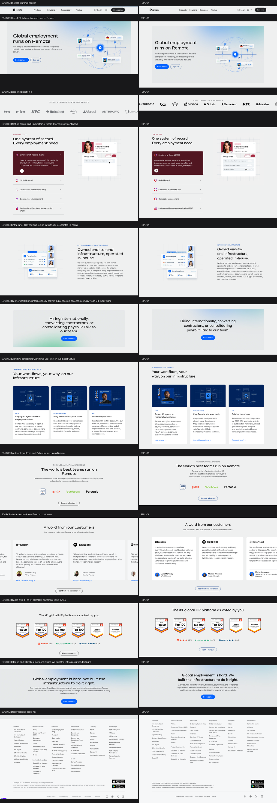

# Replica gate — rebuild-as-proof report

- brand: **Remote**
- source screenshot: `/Users/stanchev/Webflow/campaigns-hackathon/design-system-extractor-mine/screenshots/remote-v2/remote-com-fullpage.png`
- replica page: `index.html` → `replica-fullpage.png` (doc 7288px vs source 7253px)
- metric: score = 0.5·structure + 0.3·pixel + 0.2·height (Pillow RGB MAE; structure at 64px, pixel at 720px)
- `width` = content-span ratio (diagnostic, not in score): detected content width fraction of each band, min/max ratio — catches centered stacks collapsed to a fraction of the source's content width, which the averaged pixel metric barely registers
- **overall score (height-weighted): 0.951**

| band | source section | score | structure | pixel | height | width | src h | replica h | crops |
|---|---|---|---|---|---|---|---|---|---|
| page-nav | navbar (chrome header) | **0.942** | 0.932 | 0.918 | 1.000 | 0.963 | 81px | 81px | [side-by-side](diff/page-nav.png) |
| sec-0 | hero — Global employment runs on Remote | **0.920** | 0.956 | 0.941 | 0.798 | 0.904 | 550px | 689px | [side-by-side](diff/sec-0.png) |
| sec-1 | logo-wall — section-1 | **0.889** | 0.956 | 0.949 | 0.629 | 0.926 | 256px | 161px | [side-by-side](diff/sec-1.png) |
| sec-2 | feature-accordion — One system of record. Every employment need. | **0.973** | 0.978 | 0.966 | 0.973 | 1.000 | 973px | 947px | [side-by-side](diff/sec-2.png) |
| sec-3 | infra-panel — Owned end-to-end infrastructure, operated in-house. | **0.983** | 0.990 | 0.972 | 0.980 | 0.880 | 699px | 713px | [side-by-side](diff/sec-3.png) |
| sec-4 | banner-cta — Hiring internationally, converting contractors, or consolidating payroll? Talk to our team. | **0.959** | 0.962 | 0.945 | 0.971 | 0.917 | 509px | 524px | [side-by-side](diff/sec-4.png) |
| sec-5 | workflow-cards — Your workflows, your way, on our infrastructure | **0.908** | 0.908 | 0.886 | 0.944 | 1.000 | 851px | 902px | [side-by-side](diff/sec-5.png) |
| sec-6 | partner-logos — The world’s best teams run on Remote | **0.963** | 0.980 | 0.971 | 0.907 | 0.900 | 560px | 508px | [side-by-side](diff/sec-6.png) |
| sec-7 | testimonials — A word from our customers | **0.958** | 0.957 | 0.936 | 0.993 | 0.818 | 805px | 811px | [side-by-side](diff/sec-7.png) |
| sec-8 | badge-strip — The #1 global HR platform as voted by you | **0.950** | 0.948 | 0.935 | 0.979 | 1.000 | 568px | 556px | [side-by-side](diff/sec-8.png) |
| sec-9 | closing-cta — Global employment is hard. We built the infrastructure to do it right. | **0.953** | 0.952 | 0.934 | 0.986 | 0.579 | 440px | 434px | [side-by-side](diff/sec-9.png) |
| footer | footer (closing bookend) | **0.962** | 0.969 | 0.956 | 0.952 | 0.992 | 869px | 913px | [side-by-side](diff/footer.png) |

## Renderer-gap punch list

1. **hero — composite hero art** (score 0.920): composite hero art — the source layers an illustration with floating product-UI chips; the composer binds one asset per media slot (no multi-layer collage of tagged crops)
2. **closing-cta — content width diverges** (score 0.953): content span 0.44 of band vs source 0.76 (width fidelity 0.58) — check hug/measure collapse or over-wide container
3. **navbar — mega-menu open panels** (score 0.942): the brand declares mega-menu columns; the replica (and the source shot) render the closed bar only — open-panel fidelity is unexercised by this gate (diagnostic open-panel capture from the chrome preview: diff/chrome-mega-open.png)
4. **page — display font (Bossa)**: not self-hosted and not Google-loadable — headings render in the declared fallback stack; extract the woff2 files into assets/fonts/

Diagnostic, not blocking — re-run with `--fail-under <score>` to gate.
